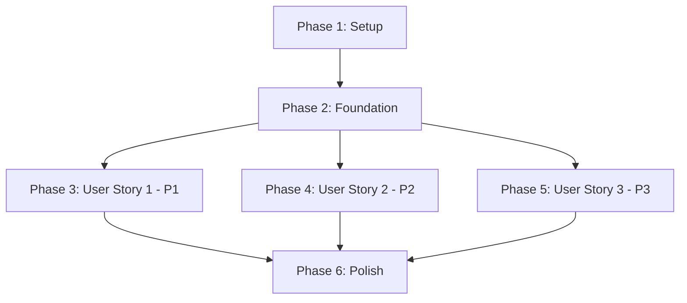

# Tasks: Node.js CLI Port - Project Foundation

**Input**: Design documents from `/specs/001-nodejs-cli-port/`
**Prerequisites**: plan.md, spec.md, research.md, data-model.md, contracts/cli-interface.md

**Tests**: This feature follows TDD workflow per constitution requirements. All tests MUST be written before implementation.

**Organization**: Tasks are grouped by user story to enable independent implementation and testing of each story.

## Format: `- [ ] [ID] [P?] [Story?] Description`

- **[P]**: Can run in parallel (different files, no dependencies)
- **[Story]**: Which user story this task belongs to (e.g., US1, US2, US3)
- Include exact file paths in descriptions

## Path Conventions

This is a single CLI project at repository root:
- Source code: `src/`
- Tests: `tests/`
- Build output: `dist/` (gitignored)
- Configuration: Root-level config files

---

## Phase 1: Setup (Shared Infrastructure)

**Purpose**: Project initialization and basic structure

- [X] T001 Create root project directories (src/, tests/, specs/) per plan.md structure
- [X] T002 Initialize package.json with project metadata (name: "claude-docs", version: "1.0.0", type: "module")
- [X] T003 Configure .npmrc with pnpm settings (save-exact=true, use-node-version=22.18.0, strict-peer-dependencies=false)
- [X] T004 [P] Configure .gitignore for Node.js project (node_modules/, dist/, coverage/, .env)
- [X] T005 Install Commander.js as production dependency (pnpm add commander)
- [X] T006 [P] Install TypeScript and @types/node as dev dependencies (pnpm add -D typescript@^5.4.2 @types/node@^22.0.0)
- [X] T007 [P] Install Biome as dev dependency (pnpm add -D @biomejs/biome@^1.9.0)
- [X] T008 [P] Install Vitest as dev dependency (pnpm add -D vitest@^2.0.0)
- [X] T009 Configure tsconfig.json with strict mode and ESM settings per research.md
- [X] T010 [P] Configure tsconfig.build.json for production compilation per research.md
- [X] T011 [P] Configure biome.json with formatting and linting rules per research.md
- [X] T012 [P] Configure vitest.config.ts with Node environment and coverage settings per research.md
- [X] T013 Add npm scripts to package.json (dev, build, test, lint, format, check, type-check, validate) per research.md
- [X] T014 Create initial README.md with installation instructions and quickstart guide

**Checkpoint**: Project structure initialized, all tools configured, ready for source code

---

## Phase 2: Foundational (Blocking Prerequisites)

**Purpose**: Core infrastructure that MUST be complete before ANY user story can be implemented

**⚠️ CRITICAL**: No user story work can begin until this phase is complete

- [X] T015 Create src/types/index.ts with base type definitions (CLIProgram, Command, Option, Argument, LogLevel, LogMessage) per data-model.md
- [X] T016 Create src/utils/config.ts with configuration constants (version from package.json, CLI name)
- [X] T017 Create tests/ directory structure mirroring src/ (commands/, lib/, utils/)

**Checkpoint**: Foundation ready - user story implementation can now begin in parallel

---

## Phase 3: User Story 1 - Developer Environment Setup (Priority: P1) 🎯 MVP

**Goal**: Developers can install dependencies, build the project, and execute a basic CLI that responds to `--version` and `--help` commands with zero linting/type errors.

**Independent Test**: Clone repository on fresh machine, run `pnpm install`, `pnpm build`, verify `node dist/cli.js --version` and `node dist/cli.js --help` work, confirm `pnpm validate` passes.

### Tests for User Story 1 (TDD - RED Phase)

> **NOTE: Write these tests FIRST (RED), ensure they FAIL, then implement (GREEN)**

- [X] T018 [P] [US1] Write failing test for CLI entry point initialization in tests/cli.test.ts
- [X] T019 [P] [US1] Write failing test for --version command in tests/commands/version.test.ts
- [X] T020 [P] [US1] Write failing test for --help command behavior in tests/cli.test.ts (may use Commander's built-in help)
- [X] T021 [P] [US1] Write failing test for unknown command error handling in tests/cli.test.ts

### Implementation for User Story 1 (GREEN Phase)

- [X] T022 [US1] Create src/cli.ts with Commander program initialization (name, version, description)
- [X] T023 [US1] Add shebang (#!/usr/bin/env node) to src/cli.ts for executable
- [X] T024 [US1] Implement --version command in src/cli.ts using Commander .version() method
- [X] T025 [US1] Configure Commander help options in src/cli.ts (auto-generated by Commander)
- [X] T026 [US1] Add error handling for unknown commands in src/cli.ts
- [X] T027 [US1] Export main() function from src/cli.ts and add `if (import.meta.url === ...)` for direct execution
- [X] T028 [US1] Verify all tests pass (GREEN phase complete) - run `pnpm test`
- [X] T029 [US1] Build project with `pnpm build` and verify dist/cli.js is created with proper shebang
- [X] T030 [US1] Test compiled CLI: `node dist/cli.js --version` should output version
- [X] T031 [US1] Test compiled CLI: `node dist/cli.js --help` should output help text
- [X] T032 [US1] Run full validation suite `pnpm validate` - confirm zero errors

**Checkpoint**: User Story 1 complete and independently testable. CLI can be installed, built, and executed with --version and --help commands.

---

## Phase 4: User Story 2 - Code Quality Enforcement (Priority: P2)

**Goal**: Developers can run automated code quality checks (linting, formatting, type checking) that detect violations and auto-fix issues where possible.

**Independent Test**: Intentionally introduce style violations or type errors, run quality checks, verify issues are reported with file locations and line numbers. Run auto-fix and confirm issues are corrected.

### Tests for User Story 2 (TDD - RED Phase)

> **NOTE: Write these tests FIRST (RED), ensure they FAIL, then implement (GREEN)**

- [X] T033 [P] [US2] Write test for Biome linting detection in tests/quality/lint.test.ts (create test file with style violation, run lint, verify error reported)
- [X] T034 [P] [US2] Write test for TypeScript type checking in tests/quality/types.test.ts (create test file with type error, run type-check, verify error reported)
- [X] T035 [P] [US2] Write test for Biome auto-fix functionality in tests/quality/autofix.test.ts (create fixable violation, run check --write, verify fixed)

### Implementation for User Story 2 (GREEN Phase)

- [X] T036 [P] [US2] Verify biome.json configuration is correct (recommended rules, organizeImports, formatter settings)
- [X] T037 [P] [US2] Verify tsconfig.json has all strict flags enabled per research.md
- [X] T038 [US2] Test `pnpm lint` command - should detect style violations and report file:line
- [X] T039 [US2] Test `pnpm format` command - should auto-fix formatting issues
- [X] T040 [US2] Test `pnpm check` command - should run lint + format together with --write flag
- [X] T041 [US2] Test `pnpm type-check` command - should detect type errors with file:line
- [X] T042 [US2] Test `pnpm validate` command - should run all checks (lint, format, type-check, tests) in sequence
- [X] T043 [US2] Verify all tests pass (GREEN phase complete) - run `pnpm test`
- [X] T044 [US2] Document code quality workflow in README.md (how to run checks, interpret errors, auto-fix)

**Checkpoint**: User Story 2 complete and independently testable. Code quality tools detect violations, report them clearly, and auto-fix where possible.

---

## Phase 5: User Story 3 - Command Structure Foundation (Priority: P3)

**Goal**: CLI provides a clear command registration system where commands can be defined, registered, and invoked with proper argument parsing and help text.

**Independent Test**: Define a simple test command with arguments, register it, invoke it from CLI, verify correct handler executes with parsed arguments. Test missing arguments trigger clear error messages.

### Tests for User Story 3 (TDD - RED Phase)

> **NOTE: Write these tests FIRST (RED), ensure they FAIL, then implement (GREEN)**

- [X] T045 [P] [US3] Write failing test for command registration system in tests/cli.test.ts
- [X] T046 [P] [US3] Write failing test for command with arguments in tests/commands/test-command.test.ts (create sample command)
- [X] T047 [P] [US3] Write failing test for missing required argument error in tests/cli.test.ts
- [X] T048 [P] [US3] Write failing test for command-specific help text in tests/cli.test.ts

### Implementation for User Story 3 (GREEN Phase)

- [X] T049 [US3] Create src/commands/version.ts as example command module (extract --version logic from cli.ts)
- [X] T050 [US3] Update src/cli.ts to register version command using .command() method
- [X] T051 [US3] Create sample command src/commands/test-command.ts with required argument to demonstrate pattern
- [X] T052 [US3] Register sample command in src/cli.ts with .argument('<name>') and .action() handler
- [X] T053 [US3] Verify Commander validates missing required arguments automatically
- [X] T054 [US3] Verify Commander generates command-specific help with `help <command>` syntax
- [X] T055 [US3] Test CLI with no arguments displays default help per contracts/cli-interface.md
- [X] T056 [US3] Test CLI with invalid command shows helpful error and suggestions
- [X] T057 [US3] Verify all tests pass (GREEN phase complete) - run `pnpm test`
- [X] T058 [US3] Document command registration pattern in README.md (how to add new commands, argument parsing, help generation)

**Checkpoint**: User Story 3 complete and independently testable. CLI command structure is clear, extensible, and well-documented for future command additions.

---

## Phase 6: Polish & Cross-Cutting Concerns

**Purpose**: Final cleanup, documentation, and performance optimization

- [X] T059 [P] Create src/lib/logger.ts with colored console logging functions (logInfo, logSuccess, logWarn, logError) per bash script analysis
- [X] T060 [P] Write tests for logger in tests/lib/logger.test.ts (verify color codes, log levels)
- [X] T061 Update README.md with comprehensive usage examples, development workflow, troubleshooting
- [X] T062 Add performance benchmarking to package.json scripts (time node dist/cli.js --version, target <50ms)
- [X] T063 Run performance benchmarks and verify <100ms startup, <50ms for --version/--help per contracts/cli-interface.md
- [X] T064 Add LICENSE file (if not already present)
- [X] T065 Add CONTRIBUTING.md with development guidelines, TDD workflow, constitution compliance
- [X] T066 [P] Verify all tests pass with `pnpm test:run` - 100% pass rate required
- [X] T067 [P] Generate test coverage report with `pnpm test:coverage` - verify meets 80% threshold per vitest.config.ts
- [X] T068 Run full validation suite `pnpm validate` one final time - zero errors required
- [X] T069 Update CHANGELOG.md with v1.0.0 foundation release notes

**Checkpoint**: Project is production-ready, fully tested, documented, and performant. Ready for Phase 2 (business logic porting).

---

## Dependencies & Execution Order

### User Story Dependencies

**Critical Path**: Setup → Foundation → US1 → Polish

**Parallel Execution Opportunities**:
- US2 and US3 can start as soon as Foundation is complete
- US1, US2, and US3 are independent and can be developed in parallel
- Most setup tasks (T003-T014) can run in parallel after T001-T002

### Execution Strategy

1. **Sequential**: Phase 1 (Setup) and Phase 2 (Foundation) MUST complete first
2. **Parallel**: User Stories 1, 2, and 3 are independent - can be worked on concurrently
3. **MVP**: Phase 3 (User Story 1) is the MVP - delivers basic working CLI
4. **Incremental**: Each user story delivers testable value independently

---

## Task Summary

**Total Tasks**: 69 tasks

**Breakdown by Phase**:
- Phase 1 (Setup): 14 tasks
- Phase 2 (Foundation): 3 tasks
- Phase 3 (User Story 1 - P1): 15 tasks (4 tests + 11 implementation)
- Phase 4 (User Story 2 - P2): 12 tasks (3 tests + 9 implementation)
- Phase 5 (User Story 3 - P3): 14 tasks (4 tests + 10 implementation)
- Phase 6 (Polish): 11 tasks

**Parallel Tasks**: 26 tasks marked with [P] can run in parallel

**Test Tasks**: 11 test tasks (TDD RED phase)

**Implementation Tasks**: 47 implementation tasks (TDD GREEN phase + setup)

**Polish Tasks**: 11 final cleanup/documentation tasks

---

## Implementation Strategy

### MVP Scope (Minimum Viable Product)
**Target**: Phase 1 (Setup) + Phase 2 (Foundation) + Phase 3 (User Story 1)

This delivers:
- ✅ Working development environment
- ✅ Installable dependencies (pnpm install)
- ✅ Buildable project (pnpm build)
- ✅ Executable CLI (node dist/cli.js --version, --help)
- ✅ Zero linting/type errors (pnpm validate)

**Estimated Tasks**: 32 tasks (Phases 1-3)
**Estimated Time**: 4-6 hours for experienced developer

### Incremental Delivery

**Release 1 (MVP)**: User Story 1 only
- Basic CLI infrastructure
- Install, build, execute workflow
- Version and help commands

**Release 2**: + User Story 2
- Code quality enforcement
- Linting, formatting, type checking
- Auto-fix capabilities

**Release 3**: + User Story 3
- Command registration pattern
- Argument parsing
- Extensibility for future commands

**Release 4 (Polish)**: + Phase 6
- Performance optimization
- Comprehensive documentation
- Production-ready release

---

## TDD Workflow Reminder

Per constitution requirements, follow strict TDD cycle:

1. **RED**: Write failing test first (T018-T021, T033-T035, T045-T048)
2. **GREEN**: Write minimal code to pass (T022-T032, T036-T044, T049-T058)
3. **REFACTOR**: Clean up code while keeping tests green
4. **VERIFY**: Run `pnpm test` - must show 100% pass rate

**Critical**: NO task is complete until its tests pass. 100% test pass rate is NON-NEGOTIABLE per constitution.

---

## Validation Checklist (Run Before Marking Complete)

- [ ] All 69 tasks checked off
- [ ] `pnpm test:run` shows 100% test pass rate (no failures, no skips)
- [ ] `pnpm test:coverage` shows ≥80% coverage
- [ ] `pnpm type-check` passes with zero errors
- [ ] `pnpm check` passes with zero violations
- [ ] `pnpm build` completes successfully
- [ ] `node dist/cli.js --version` works (<50ms)
- [ ] `node dist/cli.js --help` works (<50ms)
- [ ] README.md has comprehensive documentation
- [ ] All configuration files (tsconfig.json, biome.json, vitest.config.ts, .npmrc) are correct
- [ ] Performance benchmarks meet targets (<100ms startup)

---

## Notes

**Foundation Scope**: This task list covers ONLY the foundational infrastructure (Phase 1 of the overall project). Future task lists will cover:
- Phase 2: Core utilities (logging, file ops, config loading)
- Phase 3: Documentation download and update management
- Phase 4: Markdown transformation pipeline
- Phase 5: Caching system
- Phase 6: Search functionality
- Phase 7: Testing and CI/CD
- Phase 8: Publishing and distribution

**TDD Compliance**: All test tasks follow TDD workflow. Tests MUST be written before implementation code.

**Constitution Compliance**: All tasks align with constitution requirements (Node.js 22 LTS, TypeScript strict, Biome, Vitest, pnpm, ESM-only, zero-dependency CLI).

**Independent Testing**: Each user story can be tested independently as documented in the "Independent Test" sections.
